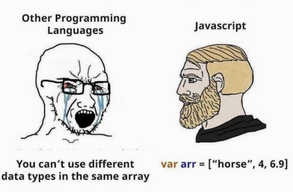

# Entregable Clase 3 Modulo 3: Arreglos y ciclos en JavaScript

## Descripción

Este proyecto pone en práctica los conceptos fundamentales de arrays (arreglos) y loops (ciclos) en JavaScript. El objetivo es desarrollar un programa que clasifique diferentes frutas y cuente cuántas hay de cada tipo, utilizando estructuras de repetición como for o while.

## Enlace del repositorio

[GitHub - Arreglos y ciclos en JavaScript Clase 3](https://github.com/AilynMza/Arreglos.y.ciclos-Clase-3-M3)

## Enlace del GitHub Pages

[GitHub Pages - Arreglos y ciclos en JavaScript Clase 3](https://ailynmza.github.io/Arreglos.y.ciclos-Clase-3-M3/)

## Conclusión

Con este ejercicio pude reforzar mi comprensión sobre arreglos y ciclos en JavaScript. Me ayudó a entender mejor cómo recorrer listas y organizar datos de manera más eficiente. 🎮

